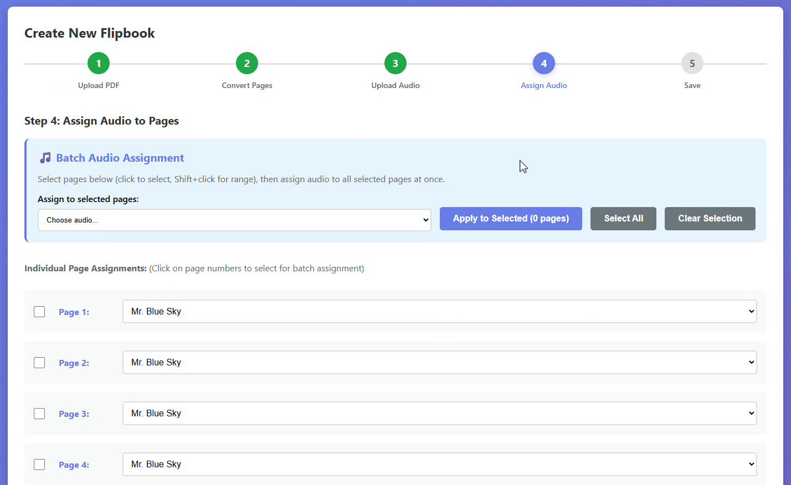
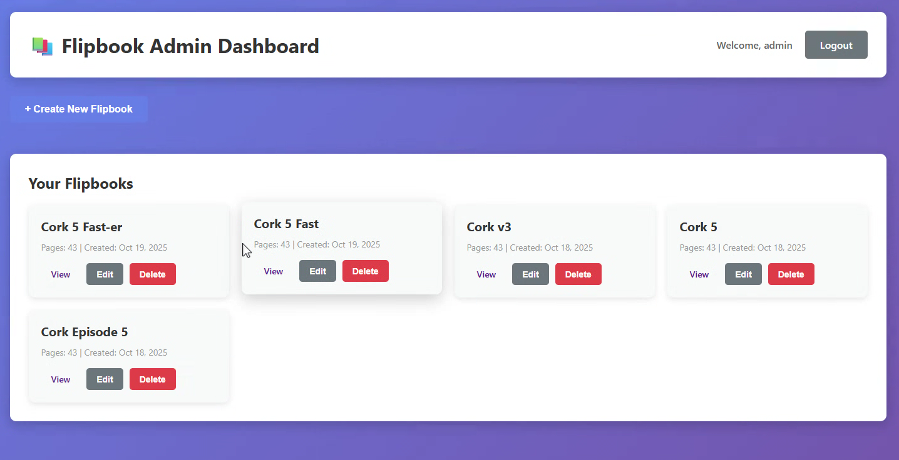
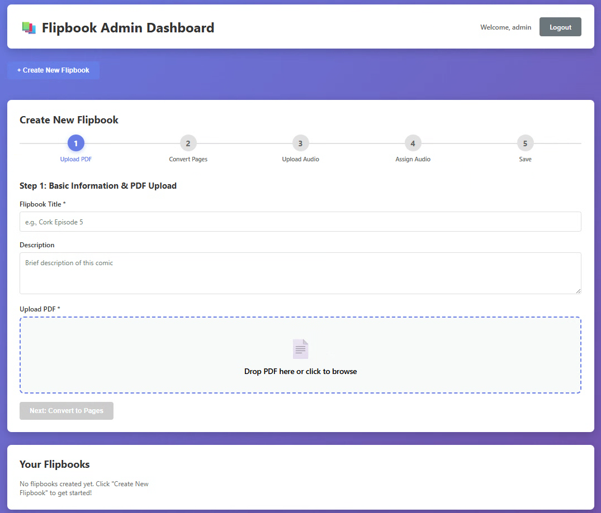
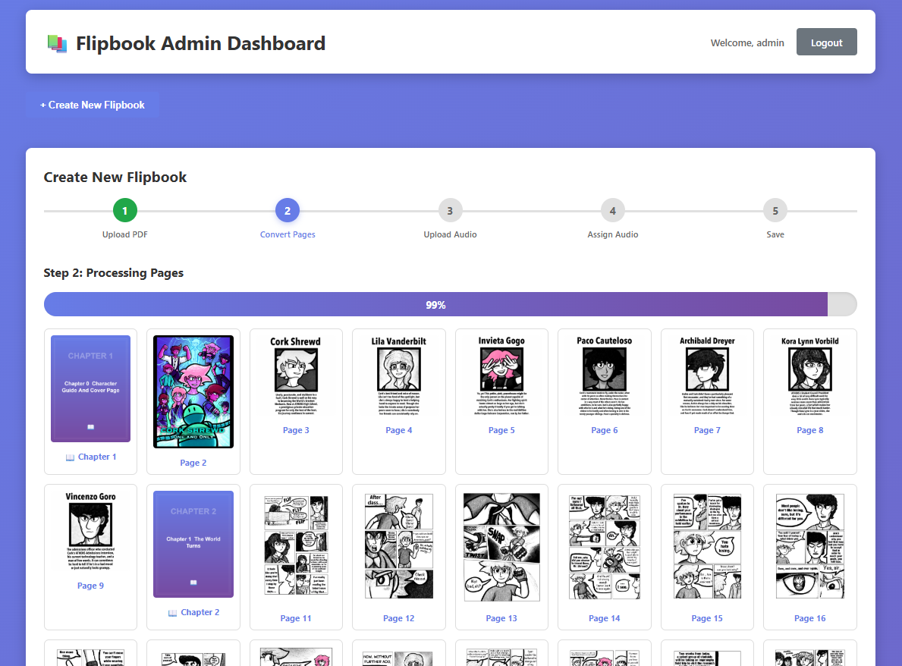

# 📚 Flipbook Plugin

A professional, self-hosted flipbook system with page-flip animations and synchronized audio playback. Perfect for digital comics, magazines, catalogs, and interactive publications.

## 📸 Screenshots

<p align="center">
  
  <br>
  <em>Interactive flipbook viewer with page-flip animations</em>
</p>

<p align="center">
  
  <br>
  <em>Clean admin dashboard for managing flipbooks</em>
</p>

<p align="center">
  
  <br>
  <em>Upload PDFs, images, or folders with drag-and-drop simplicity</em>
</p>

<p align="center">
  
  <br>
  <em>Auto-generated chapter title slides with thumbnail preview and page organization</em>
</p>

## ✨ Features

- **📖 Multiple Upload Options** - Upload PDFs OR individual images to create flipbooks
- **📁 Folder Upload with Chapter Slides** - Upload folders and automatically create beautiful chapter title slides
- **🎵 Audio Integration** - Assign background music to specific pages with 2-second crossfades
- **📦 Batch Upload** - Handle large flipbooks (50+ pages) with automatic batch processing
- **📱 Mobile-First** - Fully responsive design works on all devices
- **⚡ Fast & Lightweight** - No external dependencies, all self-hosted
- **🎨 Customizable** - Easy to theme and integrate into any website
- **🔒 Secure** - Session-based authentication, prepared statements, file validation
- **💾 File-Based Storage** - Efficient storage using image and audio files

## 🚀 Quick Start

### Requirements

- **PHP**: 7.4 or higher
- **MySQL/MariaDB**: 5.7 or higher
- **PHP Extensions**: PDO, PDO_MySQL, GD (for image handling)
- **Web Server**: Apache or Nginx
- **Disk Space**: Varies by flipbook size (50MB+ recommended per flipbook)

### Installation

1. **Download the plugin**
   ```bash
   git clone https://github.com/genetrader/flipbook-with-music.git
   cd flipbook-with-music
   ```

2. **Upload to your web server**
   - Via FTP/SFTP to your web directory
   - Or place in your local development environment

3. **Run the installer**
   - Navigate to: `http://yoursite.com/flipbook-plugin/install/install.php`
   - Follow the installation wizard
   - Enter your database credentials
   - Create admin account
   - Complete installation

4. **Delete the install folder** (Security!)
   ```bash
   rm -rf install/
   ```

5. **Login to admin**
   - Go to: `http://yoursite.com/flipbook-plugin/src/admin/login.php`
   - Use the credentials you created during installation

## 📖 Usage

### Creating Your First Flipbook

1. **Login** to the admin dashboard
2. Click **"+ Create New Flipbook"**
3. **Step 1:** Enter title and description
   - **Choose upload method:**
     - **📄 Upload PDF** - Automatically converts PDF pages to flipbook
     - **🖼️ Upload Images** - Upload individual image files (JPG, PNG, GIF)
     - **📁 Upload by Folders** - Upload folders to auto-create chapter title slides
4. **Step 2:** Wait for automatic page processing
5. **Step 3:** Upload audio files (optional)
6. **Step 4:** Assign audio to specific pages (optional)
7. **Save** and get your public viewer URL!

### Upload Methods Explained

#### PDF Upload
- Upload any PDF file
- Pages are automatically converted to high-quality images
- Perfect for existing documents and comics

#### Image Upload
- Select multiple JPG, PNG, or GIF files
- Files are processed in the order you select them
- Ideal for pre-rendered comic pages

#### Folder Upload with Chapters
- Upload a parent folder containing chapter subfolders
- System automatically detects chapters and creates title slides
- Example structure:
  ```
  Cork Episode 5/
  ├── Chapter 1 - Origins/
  │   ├── page-01.jpg
  │   └── page-02.jpg
  ├── Chapter 2 - Discovery/
  │   └── page-01.jpg
  └── Chapter 3 - Adventure/
      └── page-01.jpg
  ```
- Each chapter gets a beautiful auto-generated title slide
- Edit chapter titles before processing
- Perfect for multi-chapter comics and magazines

### Embedding Flipbooks

#### Direct Link
```html
<a href="/flipbook-plugin/src/public/viewer.php?id=1">View Flipbook</a>
```

#### iFrame Embed
```html
<iframe src="/flipbook-plugin/src/public/viewer.php?id=1"
        width="100%" height="800px" frameborder="0">
</iframe>
```

#### JavaScript Integration
```javascript
const flipbooks = {
    'book-1': '/flipbook-plugin/src/public/viewer.php?id=1',
    'book-2': '/flipbook-plugin/src/public/viewer.php?id=2',
};

document.getElementById('book-button').addEventListener('click', () => {
    window.location.href = flipbooks['book-1'];
});
```

## 🎨 Customization

### Theming

Edit `/src/admin/assets/admin.css` to customize the admin interface.

The public viewer can be themed by editing `/src/public/viewer.php` (embedded CSS).

### Configuration

After installation, edit `/src/config.php`:

```php
// Upload size limit
define('FLIPBOOK_MAX_FILE_SIZE', 50 * 1024 * 1024); // 50MB

// Debug mode (set to 0 in production)
define('FLIPBOOK_DEBUG', 0);

// Session timeout (in seconds)
define('FLIPBOOK_SESSION_TIMEOUT', 3600); // 1 hour
```

## 🔧 Advanced Configuration

### Apache Configuration

Add to your `.htaccess`:

```apache
# Protect config file
<Files "config.php">
    Order allow,deny
    Deny from all
</Files>

# Enable compression
<IfModule mod_deflate.c>
    AddOutputFilterByType DEFLATE text/html text/plain text/css application/json
</IfModule>
```

### Nginx Configuration

```nginx
location ~* \.(pdf|mp3)$ {
    expires 30d;
    add_header Cache-Control "public, immutable";
}

location ~ /config\.php$ {
    deny all;
}
```

## 📁 Directory Structure

```
flipbook-plugin/
├── src/
│   ├── config.php              # Configuration (generated by installer)
│   ├── FlipbookDB.php         # Database abstraction layer
│   ├── admin/                 # Admin interface
│   │   ├── login.php
│   │   ├── dashboard.php
│   │   ├── logout.php
│   │   └── assets/
│   │       ├── admin.css
│   │       └── admin.js
│   ├── api/                   # API endpoints
│   │   ├── save.php
│   │   ├── get.php
│   │   ├── delete.php
│   │   └── save-images.php
│   └── public/                # Public-facing
│       └── viewer.php         # Flipbook viewer
├── uploads/                   # User uploads (auto-created)
│   ├── pdfs/
│   ├── audio/
│   └── pages/
├── docs/                      # Documentation
├── install/                   # Installer (DELETE after install!)
└── README.md
```

## 🔐 Security

- **Session-based authentication** for admin panel
- **Prepared SQL statements** prevent SQL injection
- **File type validation** on uploads
- **Password hashing** with bcrypt
- **CSRF protection** recommended (implement based on your framework)

### Best Practices

1. **Delete the install folder** after installation
2. **Use strong admin passwords** (12+ characters)
3. **Restrict file permissions** (755 for directories, 644 for files)
4. **Enable HTTPS** on production
5. **Regular backups** of database and uploads folder
6. **Keep PHP updated** to latest stable version

## 🐛 Troubleshooting

### "Database connection failed"
- Check database credentials in `/src/config.php`
- Ensure MySQL is running
- Verify database user has proper permissions

### "Upload failed" or "File too large"
- Check PHP upload limits: `upload_max_filesize` and `post_max_size` in `php.ini`
- Verify disk space available
- Check upload directory permissions (755 or 775)

### Audio not playing on iOS
- iOS requires user interaction before audio plays
- The plugin includes iOS autoplay workarounds
- Ensure MP3 files are properly encoded

### Pages not loading
- Check browser console for errors (F12)
- Verify image paths in database
- Check file permissions on uploads directory

## 📚 API Reference

### Get Flipbook Data

```php
require_once 'src/config.php';
require_once 'src/FlipbookDB.php';

$db = new FlipbookDB();
$flipbook = $db->getCompleteFlipbook(1);
```

### Create Flipbook Programmatically

```php
$db = new FlipbookDB();
$id = $db->createFlipbook('My Book', 'Description', 'portrait');
```

See `/docs/API.md` for complete API documentation.

## 🤝 Contributing

Contributions are welcome! Please:

1. Fork the repository
2. Create a feature branch (`git checkout -b feature/amazing-feature`)
3. Commit your changes (`git commit -m 'Add amazing feature'`)
4. Push to the branch (`git push origin feature/amazing-feature`)
5. Open a Pull Request

## 📄 License

MIT License - See [LICENSE](LICENSE) file for details.

## 🙏 Credits

**Created by:** Mike W / [Larger Than Life Comics](https://largerthanlifecomics.com)
**Developer:** Gene W

**Built with:**
- [PDF.js](https://mozilla.github.io/pdf.js/) - PDF rendering
- [StPageFlip](https://github.com/Nodlik/StPageFlip) - Page flip animations
- Web Audio API - Audio crossfades

## 🔗 Links

- **Documentation:** [/docs/](/docs/)
- **Issues:** [GitHub Issues](https://github.com/genetrader/flipbook-with-music/issues)
- **Demo:** [Coming Soon]

## 📊 Version History

### v1.0.0 (2025-01-XX)
- Initial release
- PDF to flipbook conversion
- Audio synchronization with 2-second crossfades
- Admin dashboard
- Public viewer
- Installation wizard

---

**Made with ❤️ for digital publishers everywhere**
